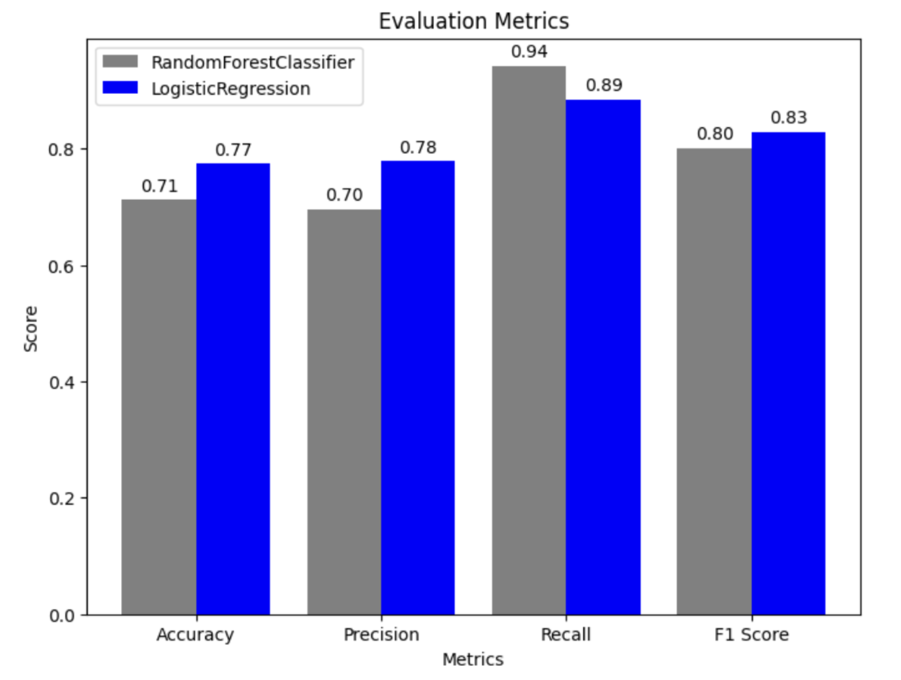

# Stock Market Sentiment Analysis

**Latest Update**: December 19, 2023
## Table of Contents
- [Data Set](#data-set)
- [ML Methods](#ml-methods)
- [Next Steps](#next-steps)
- [Miscellaneous](#miscellaneous)
## Data Set 

My CPEN 355 Final Project is based off the [Stock Market Sentiment](https://www.kaggle.com/datasets/yash612/stockmarket-sentiment-dataset/data) Kaggle data set. 

I did some NLP preprocessing by using regex to remove hashtags and hyperlinks. Then I tokenized the words to get rid of NLTK's stop words excluding some words. Then I recombine the words together so that I can vectorize the text after.

I added an extra feature by doing one-hot encoding on financial phrases and words that more obviously influences a text phrase sentiment towards a more positive or negative standpoint.

## ML Methods

Here, I compare Sklearn's Logistic Regression and Random Forest Classifier models after doing hyperparameter tuning. With the most optimal hyperparameters for both models, below is the evaluation metrics for the test data. 
<!-- 
 -->

The complexities of the RandomForestClassifier model was not advantageous for our stock text dataset as it achieved a lower accuracy than the Logistic Regression model. The accuracies achieved by both models is lower than the ideal for a robust model. However, it represents the best outcome that can come from the data set used. 

## Next Steps 

A few ideas on how to improve the accuracy of the model:
- Improve the weighting of my feature engineering step as the vectorization step may have made it very miniscule(as the vectorization step created 5000 more features to give different weights to words)
- Create my own vectorization step, weigh sentiment based on 2/3 words side by side in text after going through preprocessing step 
- Add lemmatizing and stemming to the NLP pipeline.

## Miscellaneous

**Libraries used**: Numpy, Sklearn, NLTK, Pandas, Matplotlib

🔗 Full documentation of the Project Results are in this: [Report Link](/extra/Stock_Data_Classification_Report.pdf)